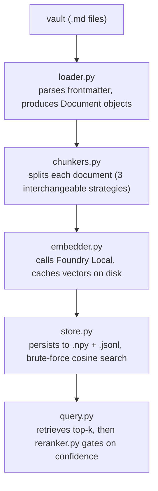

# Recall

[](https://www.python.org/)
[](tests/)
[](LICENSE)

A fully local, retrieval-only RAG pipeline over a personal Obsidian-style
Markdown wiki. It answers the retrieval half of Retrieval-Augmented
Generation — find the right passages for a question — and stops there on
purpose; see "Retrieval-only evaluation" under
[Design decisions](#design-decisions) for why.

Built for the Microsoft AI Summer Program as a hands-on exploration of
retrieval mechanics, not a production tool. [Results](#results) covers what
was measured and learned, which is the point of the project as much as the
code is.

[](https://youtu.be/EcNWpuXGeC4)

**[Walkthrough and live demo](https://youtu.be/EcNWpuXGeC4)** (5 min, spoken in
Turkish) — the design decisions and measured results below, followed by the
dashboard answering two questions and refusing a third one that falls outside
the knowledge base.

| | |
|---|---|
| **Corpus** | 91 markdown files, ~55,000 words, Turkish prose with English technical terms |
| **Best chunker** | `by_heading` — 0.809 HitRate@1, 0.870 MRR (57-question eval set) |
| **Out-of-scope gate** | Cross-encoder, AUROC 0.979, cost-fitted threshold, 5-fold cross-validated |
| **Tried and rejected** | Cross-encoder re-ranking, TF-IDF hybrid search — both measured worse |
| **Not built** | Answer generation — retrieval-only by design, see below |
| **Interface** | CLI (`query.py`) and a Streamlit dashboard ("Recall") |

## Contents

- [Overview](#overview)
- [Architecture](#architecture)
- [Setup](#setup)
- [Design decisions](#design-decisions)
- [Data privacy](#data-privacy)
- [Results](#results)
- [Status](#status)

## Overview

The system indexes 91 markdown files (~55,000 words of Turkish-language data
science / ML course notes with mixed English terminology), splits them into
chunks, embeds them with a local model, and retrieves the most relevant
sources for a question using vector similarity search. No data leaves the
machine.

```bash
python src/build_index.py --chunker by_heading
python src/query.py "Why is the ROC curve threshold-independent?"
```

```
Question: Why is the ROC curve threshold-independent?

Top 5 sources (by_heading index):

[1] concepts/roc-auc.md  (score: 0.5306)
    ROC Eğrisi ve AUC (concept) tags: concept, ml, classification, evaluation ...
[2] concepts/dogrusal-regresyon.md  (score: 0.4632)
    ...
```

A Streamlit dashboard ("Recall") wraps the same pipeline for interactive
use: a question in, ranked sources out, with the same cross-encoder
confidence gate as `query.py`. A quiet "How does this work?" link opens the
same evaluation reports covered in [Results](#results), without opening
files individually.

```bash
streamlit run src/dashboard.py
```

The dashboard is a presentation layer only — it imports `search()` and
`Reranker` directly from the same modules `query.py` uses, so there is no
separate retrieval logic to keep in sync.

## Architecture



Every stage is a plain function or a small class with one responsibility, so
swapping a component (a different embedding model, a vector database, a
generation step) means touching one file, not the pipeline.

| Folder | Contains |
|---|---|
| `src/` | the pipeline itself |
| `experiments/` | measurement scripts that produced everything under `results/` |
| `tests/` | unit tests for the pipeline |
| `eval/` | the gold-standard question set |
| `results/` | measured outcomes, regenerated by the experiment scripts |

`experiments/` is kept separate from `src/` deliberately: those scripts
answer questions about the system (which chunker wins, where the confidence
threshold belongs) and are run occasionally, while `src/` is what actually
serves a query.

Tests cover frontmatter parsing (including the flashcard `---` collision),
all three chunking strategies, index persistence and search, and the
feedback log:

```bash
pytest tests/
```

## Setup

**Prerequisites:**
- Python 3.11+
- [Microsoft Foundry Local](https://learn.microsoft.com/en-us/azure/foundry-local/get-started)
  installed and running (`winget install --id Microsoft.FoundryLocal`, then
  `foundry server start`). This is a system-level CLI tool, not a Python
  package — it is not in `requirements.txt`.

```bash
python -m venv .venv
.venv\Scripts\activate
pip install -r requirements.txt

foundry model download qwen3-embedding-0.6b
```

To index your own vault, set the `COACH_VAULT_PATH` environment variable
before running `build_index.py`. Without it, the included sample data under
`data/sample/` lets you try the system end-to-end with no vault at all — see
[Data privacy](#data-privacy).

```bash
python src/build_index.py --chunker by_heading   # best-performing strategy, see Results
python src/query.py "your question here"
```

## Design decisions

| Decision | Why |
|---|---|
| Foundry Local's HTTP endpoint, not its Python SDK | The SDK only ever reported a CPU model variant; the REST API serves the cached GPU one correctly |
| No framework — LangChain not used | The embedding matrix is a few MB; brute-force cosine is sub-millisecond. A vector DB would solve a scaling problem this project doesn't have |
| Retrieval-only, no generation | Keeps the evaluated variable (chunking/retrieval) isolated from an unimplemented generation step |
| Truncate at 1,200 words, not the advertised 32,768-token limit | The endpoint actually returns HTTP 500 past ~1,500-2,000 words — found empirically, not assumed |

<details>
<summary><strong>Foundry Local for embeddings, via its HTTP endpoint rather than the Python SDK</strong></summary>

<br>The embedding provider is Microsoft Foundry Local (`qwen3-embedding-0.6b`,
CUDA GPU variant, 1024-dim). Two issues surfaced along the way and are
documented here since they cost real debugging time:

- *Setup hang.* The Foundry Local service daemon hung indefinitely while
  registering the OpenVINO execution provider. Root cause: a pending Windows
  update was blocking AppX package delivery — closing/reopening the machine
  did not resolve it, because Fast Startup skips a real reboot. Only
  Start menu → Restart cleared the pending update and let the execution
  provider install. `src/embedder.py` was kept isolated from the rest of the
  pipeline throughout — a CPU-only `sentence-transformers` fallback was used
  while this was being diagnosed, and switching back was a single-file
  change once the root cause was fixed.
- *SDK/CLI mismatch.* Once the service was healthy, the Python SDK
  (`foundry_local_sdk`) would only ever report a `generic-cpu` model variant
  and failed to load the cached CUDA variant, even though `foundry model
  list` and the CLI confirmed the GPU variant was cached and loadable.
  `embedder.py` bypasses the SDK and talks to Foundry Local's
  OpenAI-compatible REST API directly, discovering the live port via
  `foundry status -o json` rather than hardcoding it (the port is not
  stable across restarts).

</details>

<details>
<summary><strong>Empirical context limit, not the advertised one</strong></summary>

<br>The catalog reports `context_length: 32768` tokens, but in practice the
CUDA embedding endpoint returns HTTP 500 past roughly 1,500-2,000 words.
This was found by embedding the full 91-file corpus and bisecting the
failure on the largest file (`ml-pipeline.md`, 2,813 words). `embedder.py`
truncates to 1,200 words with logging (7 of 91 whole-document chunks were
affected) rather than failing silently or trusting the documented limit.

</details>

<details>
<summary><strong>No framework — LangChain was deliberately not used</strong></summary>

<br>The embedding API is a single HTTP call, and storage is plain `.npy` +
`.jsonl`: for this corpus size, the embedding matrix is a few megabytes and
brute-force cosine similarity (`matrix @ vector`) runs in sub-millisecond
time. A vector database would solve a scaling problem this project does not
have; adding one would add a dependency, a schema, and an approximation
error for no measurable benefit at this scale.

</details>

<details>
<summary><strong>Retrieval-only evaluation</strong></summary>

<br>`query.py` returns ranked sources without generating a natural-language
answer. This keeps the evaluated variable (chunking strategy) isolated from
a constant, unimplemented generation step. A chat model (`qwen2.5-0.5b`) is
available in Foundry Local and could be added later without touching
retrieval or evaluation code.

</details>

## Data privacy

All code is public. The actual vault content (`data/index/`, `data/cache/`)
is excluded via `.gitignore` and never committed. `data/sample/` contains 5
fabricated example pages — structurally representative of the real vault,
but entirely fictional — used to demonstrate that the system works.

## Results

### Chunking strategy comparison

Three chunking strategies were compared on a 57-question gold-standard set
(`eval/questions.yaml`, written against the vault's own contents) covering
direct, paraphrased, multi-document, code-switched, and out-of-scope
questions:

| chunker | chunks | HitRate@1 | HitRate@5 | Recall@5 | MRR |
|---|---|---|---|---|---|
| whole_doc | 91 | 0.745 | **0.957** | 0.883 | 0.840 |
| **by_heading** | 319 | **0.809** | 0.936 | **0.904** | **0.870** |
| fixed_window | 239 | 0.723 | 0.936 | 0.858 | 0.822 |

Splitting on markdown `## ` headings gives the best rank-1 accuracy and MRR:
structure-aware chunking mainly helps rank the correct source *first*.
Interestingly, `whole_doc` edges ahead on HitRate@5 — when the whole file is
one chunk it is harder to miss the right document entirely, but harder to
rank it top. Full table: `results/chunking.md`.

**Evaluation-set size matters, measurably.** An earlier version of the eval
set had 26 questions covering 28 of the vault's 91 documents and put
`by_heading` at HitRate@1 0.917. Expanding it to 57 questions across 41
documents moved that to 0.809 and narrowed the margin over the naive
baseline from +0.250 to +0.086. The ranking of the three strategies was
unchanged, but the effect size on the smaller set was optimistic — worth
recording, since the same pattern is easy to miss when a single evaluation
run is reported as fact.

### Out-of-scope detection

Five attempts, in order, to answer one question: how should the system know
when a question is outside the vault?

| # | Attempt | Result |
|---|---|---|
| 1 | Fixed similarity threshold | ✗ Doesn't separate the groups — some out-of-scope questions score *higher* than in-scope ones |
| 2 | Cross-encoder as a confidence gate | ✓ AUROC 0.979 — the signal itself works well |
| 3 | Threshold read off a small sample | ✗ Flipped on 2 of 4 topics when questions were reworded |
| 4 | Cost-minimised, cross-validated threshold | ✓ 3/33 false accepts, 5/47 false refuses on held-out questions |
| 5 | Same cross-encoder used to re-rank results | ✗ HitRate@1 dropped from 0.809 to 0.596 — gate and ranker stay separate |

**Negative result: similarity alone doesn't work.** No chunking strategy
reliably rejects out-of-scope questions using the bi-encoder's similarity
score with a fixed threshold. Investigating rather than simply raising the
threshold surfaced why: some out-of-scope questions score *higher* than
genuine in-scope minimums — one where "recipe" (tarif) coincidentally
overlaps with "recommendation" (öneri) in embedding space, another where a
different technical domain (Blockchain) shares enough vocabulary register
with ML/data-science text to score deceptively high. Everyday questions with
no shared vocabulary score low as expected; the failures cluster on
technical questions from adjacent domains. Full analysis:
`results/threshold_analysis.md`.

**Fix: a cross-encoder as a confidence gate.** A cross-encoder
(`cross-encoder/mmarco-mMiniLMv2-L12-H384-v1`), which scores a question
against a candidate chunk directly instead of comparing two independent
embeddings, separates the two groups far better: AUROC 0.979 over 47
in-scope and 32 out-of-scope questions from the fixed evaluation set
(`results/abstention_metrics.md`). `query.py` uses it purely as a gate —
"should this question get an answer at all" — not to re-rank results.

**Negative result: a threshold read off a small sample is not stable.**
Setting the cutoff to clear the lowest in-scope score in a small sample
looked clean on that sample but generalised poorly. Testing it against
paraphrases of the same out-of-scope questions
(`results/threshold_robustness.md`) showed the decision could flip on 2 of 4
topics purely from rewording. Tuning a more elaborate rule against those
same questions scored perfectly on them and then missed 7 of 20 questions
held back from the tuning — the gain was fitted to the sample, not to the
problem.

**How the threshold is actually chosen.** The AUROC above shows the signal
itself separates the groups well, so the difficulty is where to cut. The
threshold used for fitting draws on a separate, larger pool than the fixed
evaluation set: it also folds in real corrections recorded through the
dashboard (47 in-scope, 33 out-of-scope as of this writing — see "The
feedback loop is not hypothetical" below). Minimising a stated cost
function on that pool — answering an out-of-scope question is weighted
twice as costly as refusing an in-scope one — and validating with 5-fold
cross-validation reports 3/33 false accepts and 5/47 false refuses *on
questions the threshold was not fitted on*
(`experiments/calibrate_threshold.py`, `results/threshold_selection.md`).
The fitted value varies by less than 1 across folds and is unchanged for
cost ratios from 1:1 to 3:1, so it sits in a stable region rather than on a
knife edge. A Platt-scaled version of the same score is reported alongside
it, so the operating point can also be read as a confidence level. Metric
choice follows Wen et al., *Know Your Limits: A Survey of Abstention in
Large Language Models*, TACL 2025.

One caveat worth stating: the threshold is specific to the `by_heading`
index. Chunk length shifts the cross-encoder's score distribution, and the
same cutoff applied to `whole_doc` wrongly refuses far more in-scope
questions. Both `query.py` and the dashboard therefore pin that index rather
than offering a choice that would silently break the calibration.

**The feedback loop is not hypothetical.** The threshold is still fitted on
a question set written by hand, which is only a guess at what gets asked —
the bug above was found by asking something nobody had thought to include.
The dashboard's "this should have been answered / refused" control writes
corrections to `data/gate_feedback.jsonl` (gitignored — it can contain real
questions asked against a real vault), and `calibrate_threshold.py` folds
those in automatically on the next fit. This is not a hypothetical
mechanism: one real out-of-scope question, initially misclassified, moved
the fitted threshold from -3.94 to -3.68, the value the pipeline now ships
with. The number in `src/reranker.py` is meant to track whatever
`calibrate_threshold.py` currently returns, not to stay fixed at the value
first measured on the 57-question set.

**Negative result: the same model should not also re-rank.** Using the
cross-encoder to *re-rank* the top-10 bi-encoder results, instead of just
gating them, was tried and actively hurt ranking quality
(`results/rerank_impact.md`). HitRate@1 on `by_heading` dropped from 0.809
to 0.596 — the cross-encoder, trained on MS MARCO query-passage pairs,
systematically prefers longer, explanatory chunks (flashcards, broad source
pages) over this vault's atomic one-concept-per-page style, even when the
atomic page contains the exact question terminology. The two mechanisms are
kept separate for that reason: bi-encoder ranking is left untouched, and
the cross-encoder decides only whether to show a confidence warning.

### Disagreement analysis

Sorting all scored questions on the `by_heading` index by reciprocal rank
surfaces the cases where retrieval disagrees most with the gold standard
(`results/disagreement_analysis.md`). One case turned out to be a
gold-standard gap, not a retrieval bug: the vault uses two slugs for the
same imbalanced-data topic (an English source-page slug and a Turkish
concept-page slug, an inconsistency that predates this project), and the
eval set originally listed only one of them as correct. Fixing the expected
list moved that question from a miss to a perfect score and changed nothing
about the retrieval code — a reminder that a "wrong" retrieval result is
worth checking against the labels before it's checked against the model.

The two disagreements that survived that fix are genuine bi-encoder
weaknesses: a paraphrased question about overfitting ("does great in
training, fails on real data") loses to a page about imbalanced datasets
that shares the same rhetorical shape ("looks good on one measure, fails in
practice") without being the same topic, and a paraphrased clustering
question loses to a page framed as a similar-sounding interview question. In
both cases the correct page uses different terminology than the query (no
"overfitting", no "clustering"), and the bi-encoder ranks by whole-passage
embedding proximity rather than topical correctness — matching vocabulary
can outscore the page that actually answers the question.

### Hybrid search

**Negative result.** The disagreement analysis above suggests a fix worth
testing: combine the bi-encoder with TF-IDF keyword matching
(`experiments/keyword_search.py`), on the theory that exact-term overlap
could catch cases the embedding misses. Measured directly
(`experiments/evaluate_hybrid.py`, `results/hybrid_impact.md`) — it doesn't
help. A min-max-normalized weighted sum underperforms the bi-encoder alone
at every weight tested:

| weight on meaning-based search | HitRate@1 |
|---|---|
| 1.0 (meaning only, shipped) | **0.809** |
| 0.9 | 0.766 |
| 0.7 | 0.745 |
| 0.5 | 0.723 |
| 0.3 | 0.702 |

The reason ties back to the corpus: hybrid search is usually
justified by covering the embedding's blind spots on rare terms or exact
codes, but this corpus's real blind spot — paraphrased questions that share
rhetorical register with an unrelated page — isn't a keyword-overlap
problem, so TF-IDF has nothing useful to add and mostly just dilutes a
stronger signal with a weaker one. `query.py` was not changed; this stays a
measured-and-rejected experiment, not a shipped feature — the point of
running it was to check an intuition against data rather than assume a
"hybrid search is always safer" default.

## Status

Working end to end: retrieval over the vault, three chunking strategies
indexed and compared on a 57-question gold-standard set, an out-of-scope
gate whose threshold is fitted by cost minimisation and cross-validated, a
disagreement analysis of the worst-ranked questions, two retrieval ideas
tested and rejected with evidence (cross-encoder re-ranking, hybrid
keyword+vector search), a Streamlit dashboard, and unit tests over the
pipeline.

Known limits, stated rather than papered over: the gate still accepts a
small number of out-of-scope questions and refuses a few in-scope ones (3 of
33 and 5 of 47 respectively under cross-validation), and the threshold is
specific to the `by_heading` index. Retrieval is evaluated on whether the
right *document* is ranked highly, not on whether the retrieved passage
actually contains the answer — a stricter measure that would need a
separate annotation pass.

## License

[MIT](LICENSE)
